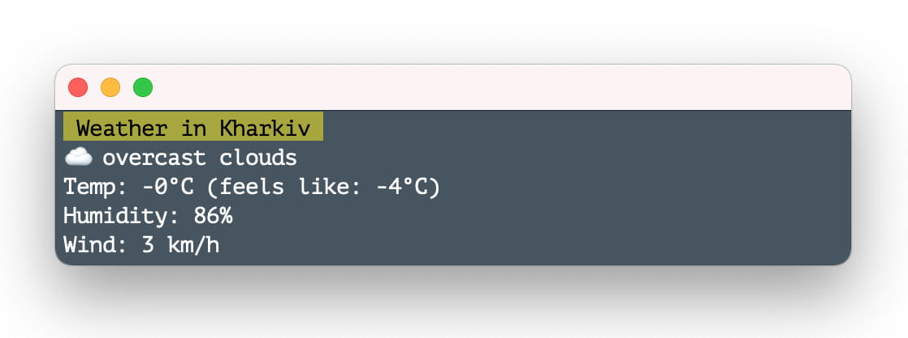

# Weather CLI

NPM CLI package to show weather using OpenWeather API

## Installation

Requires [Node.js](https://nodejs.org/) v14+ to run.

1. Install globally

```sh
$ npm i -g printweather-cli
```
2. Set token (Get your own on https://home.openweathermap.org/api_keys)
```sh
$ weather -t [TOKEN]
```
3. Set city
```sh
$ weather -s [CITY]
```
4. Get weather
```sh
$ weather
```
## License

MIT

**Free Software, Hell Yeah!**